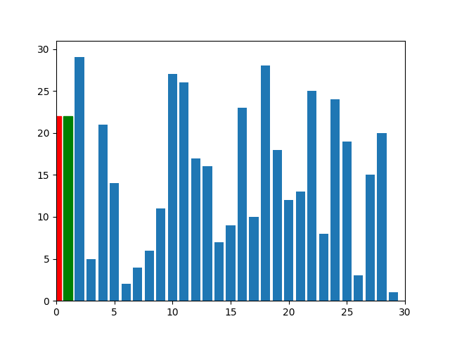

# Insertion Sort Algorithm

## Overview

Insertion Sort is a straightforward and intuitive sorting algorithm that builds the final sorted list one item at a time. It's akin to how most people arrange a hand of playing cards, picking one card at a time and placing it in its correct position.

## How It Works

1. **Starting Point**: Consider the first element of the list as "sorted" and start from the second element.
2. **Current Element**: Take one element from the unsorted portion, marking it as the "current element."
3. **Comparison**: Compare this current element with the previous elements.
   - If the current element is smaller than the previous element, we keep comparing with the elements before until we reach an element smaller or reach the start of the list.
   - If the current element is larger, it remains in its place.
4. **Insertion**: Insert the current element in the correct position so that the "sorted" portion of the list remains sorted.
5. **Repetition**: Repeat the process for each of the elements in the list.

## Key Characteristics

- **In-Place**: Insertion Sort uses only a constant amount of extra memory, making it an in-place sorting algorithm.
- **Stable**: If two elements have equal values, the order will be preserved, making it a stable sort.
- **Performance**: Its average and worst-case time complexity is \(O(n^2)\), where \(n\) is the number of items being sorted. However, for nearly sorted lists, its performance can be much better, making it adaptive.
- **Adaptive**: The time complexity can improve to \(O(n)\) for nearly sorted lists, as fewer elements would need repositioning.

## Use Cases

- Effective for small datasets or datasets that are nearly sorted.
- Often used as a building block in more advanced sorting algorithms.
- Suitable for real-time systems since its worst-case time complexity is not much different from its average-case complexity.
- Not ideal for large datasets due to its \(O(n^2)\) time complexity.

## Conclusion

Insertion Sort, with its simple logic, is a fundamental algorithm taught in computer science courses. While it may not be the most efficient for large datasets, its adaptiveness and efficiency on nearly sorted lists make it a valuable tool in specific scenarios.