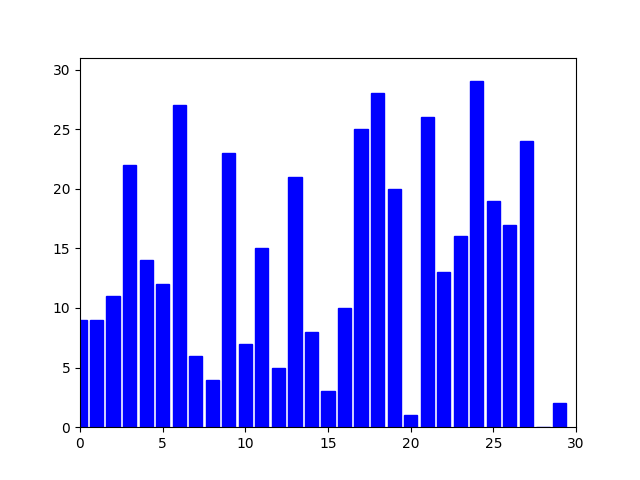

# Merge Sort Algorithm

## Overview

Merge Sort is a divide-and-conquer sorting algorithm that breaks down a list into smaller sublists, sorts those sublists, and then merges them back together in the correct order. It's known for its consistent performance and efficiency.

## How It Works

1. **Divide**: The list is recursively divided in half until each sublist contains a single element. A list with a single element is considered sorted.
2. **Conquer**: Once the list is broken down to single elements, the merging process begins. This is where the actual sorting happens.
3. **Merge**: Two adjacent sublists are taken and merged together in a sorted manner. This merging process continues until we have a single sorted list.

## Key Characteristics

- **Divide and Conquer**: The algorithm breaks the problem down into smaller, more manageable subproblems until they become simple enough to be solved directly.
- **Stable**: The relative order of equal elements will remain unchanged, making it a stable sort.
- **Performance**: Merge Sort has a time complexity of \(O(n \log n)\) in all cases (best, average, and worst), where \(n\) is the number of items being sorted.
- **External Memory**: Unlike some other algorithms like Bubble Sort, Merge Sort is not in-place. It requires additional space proportional to the size of the list being sorted.
- **Adaptability**: While the basic algorithm isn't adaptive, variations can be made adaptive based on certain conditions.

## Use Cases

- Suitable for larger datasets, especially when consistent performance is required.
- Often used in external sorting processes where data is too large to fit into the RAM and resides in slower external memory (like disk drives).
- Due to its stable nature, it's beneficial when the stability of the sort is crucial.

## Conclusion

Merge Sort is a powerful and consistent sorting algorithm. Its divide-and-conquer approach ensures that it can handle large datasets efficiently. While it does require additional memory space for its operations, its performance and stability often make it a preferred choice in many applications.