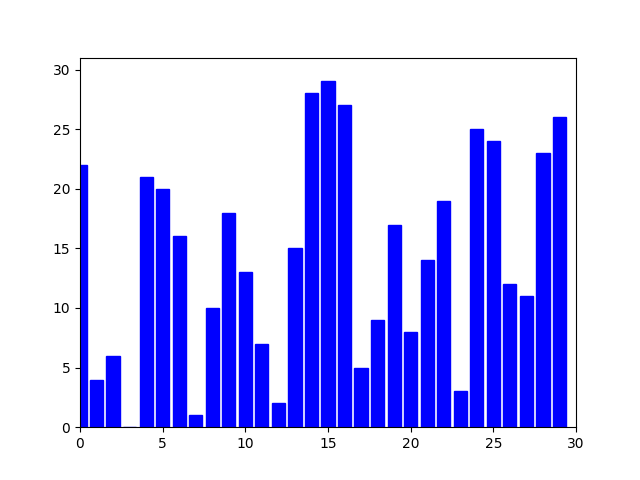

# Quick Sort Algorithm

## Overview

Quick Sort is a highly efficient and widely-used sorting algorithm that employs a divide-and-conquer strategy to sort elements in a list.

## How It Works

1. **Pivot Selection**: Choose an element from the list, known as the 'pivot'.
2. **Partitioning**: Rearrange the list so that all elements smaller than the pivot come before it, while all elements greater than the pivot come after it. After this step, the pivot is in its final sorted position.
3. **Recursive Sort**: Recursively apply the above two steps to the sub-list of elements before the pivot and the sub-list of elements after the pivot.
4. **Completion**: The algorithm concludes when the base case (a list of zero or one element) is reached for all sub-lists.

## Key Characteristics

- **In-Place**: Quick Sort sorts the list in-place, meaning it doesn't require additional storage proportional to the list's size.
- **Not Stable**: The relative order of equal elements might change, so it's not a stable sort.
- **Performance**: Its average-case time complexity is \(O(n \log n)\), where \(n\) is the number of items being sorted. However, in the worst-case scenario (rarely encountered with good implementations), it can degrade to \(O(n^2)\).
- **Partition Strategy**: The efficiency of Quick Sort is highly dependent on the method used to select the pivot and partition the list. A common strategy is to choose the median, a random element, or the middle element as the pivot.

## Use Cases

- Highly efficient for large datasets.
- Often faster in practice than other \(O(n \log n)\) algorithms like Merge Sort or Heap Sort due to smaller hidden constants and good cache performance.
- Suitable for external sorting where data is stored outside the main memory, like disk storage.

## Conclusion

Quick Sort is a powerful sorting algorithm that combines efficiency with the practical benefits of being in-place and having good average-case performance. Its divide-and-conquer approach allows it to handle large datasets effectively, making it a popular choice in many real-world applications.